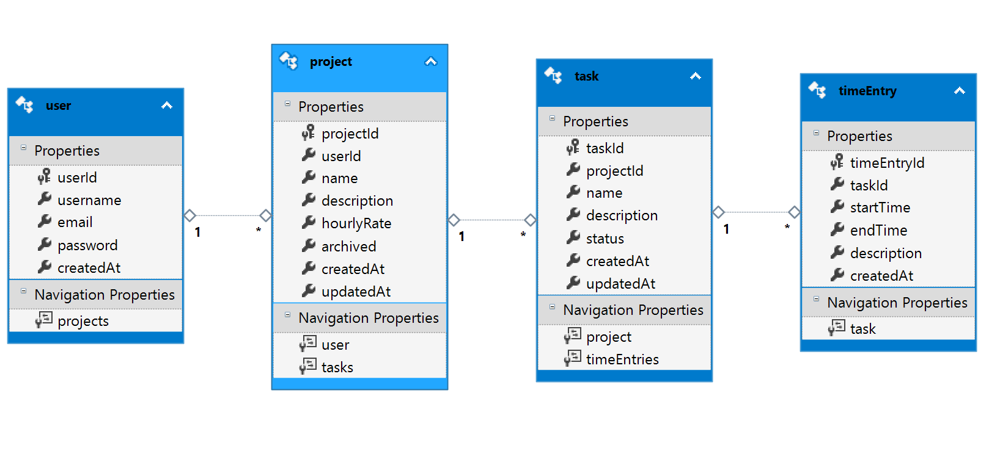
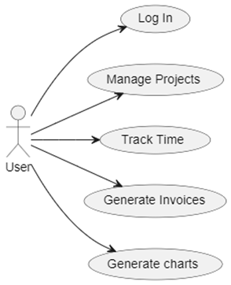

# Ticksy

## Project description

Ticksy is a time-tracking application. While logged into their account, users can manage projects, clients, track productivity, generate invoices and produce detailed reports. It is designed to efficiently log hours worked, manage tasks, and track their progress.

With Ticksy, users can simplify payments and generate charts to show time spent on tasks and earnings, making it an essential tool for freelancers and hourly remote workers.

### Technologies used

-   WPF
-   C# .NET
-   Database: Azure SQL
-   Entity Framework via LINQ
-   Hosting: Azure

### Additional libraries

-   Extended WPF Toolkit
-   Material Design Toolkit
-   PDF generation
-   Unit testing: Visual Studio unit testing or NUnit

### Special features

-   Wizards
-   Focused entry timer
-   PDF handling
-   Drag and drop

## ER Diagram

## Use Cases

## Daily Scrum

Find our daily scrum meetings [here](docs/DailyScrum.md)
